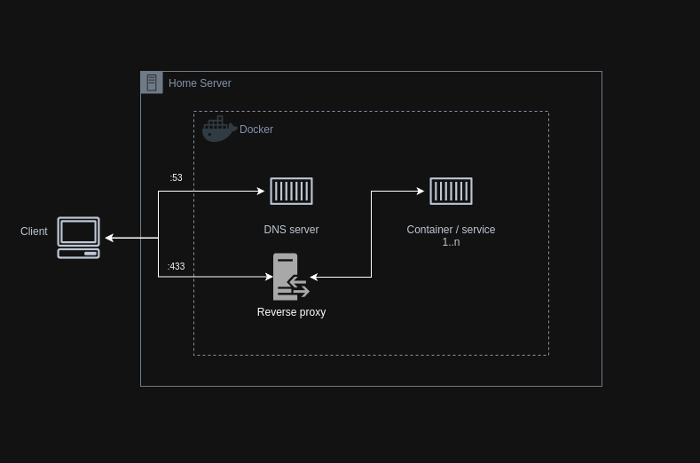

# Automated Homelab Infrastructure Deployment with Ansible

This repository contains Ansible playbooks for provisioning and managing
a self-hosted homelab running Dockerized services on a local network.

The goal of this project is to provide a scalable and reproducible
infrastructure where new services can be added with minimal effort.
By treating the homelab infrastructure as code, the setup can be easily extended,
reconfigured, or redeployed as requirements evolve.

It simplifies adding new services by leveraging **Traefik** as a reverse
proxy, dynamically routing incoming network traffic based on subdomains
to the corresponding Docker containers. Self-signed SSL certificates are
used to ensure secure communication within a local network.

The configuration also includes a Dropbear SSH server setup on boot, allowing
remote unlocking of full-disk encrypted systems without interacting with the
server directly, enabling secure management during system startup and remote
maintenance.

With this approach, services are consistently deployed and managed using
Docker, allowing the homelab to grow organically while maintaining a
clean, maintainable, and automated foundation for self-hosting on a home
server.

Note: The included Ansible playbooks are designed to work with Debian-based servers, using apt for package management.

### **Current Services**

- **Traefik** - A reverse proxy to route network traffic to docker containers
- **Portainer** – Manage Docker containers via web UI
- **Nextcloud** – File sharing and cloud services
- **Gitea** – Self-hosted Git server with web UI
- **Pi-hole** – DNS server for managing custom domains and ad-blocking
- **Dropbear** – Remote unlocking of server disk encryption

After deployment, the services can be accessed through the following domains (when using home.arpa as the main domain):

- **Traefik:** `traefik.home.arpa`
- **Portainer:** `portainer.home.arpa`
- **Nextcloud:** `next.home.arpa`
- **Gitea:** `gitea.home.arpa`
- **Pi-hole:** `pihole.home.arpa`

### Infrastructure diagram


    
## Server System setup

Read [system setup](system-setup.md) readme for instructions.

## Ansible configuration

### Install ansible galaxy collections to the machine you are using to run the ansible tasks

```
ansible-galaxy collection install docker
```

### Add deployment hosts file

Copy `hosts.template` as `hosts` file and update the following line on with the target server ip-address

```
server_1         ansible_host=<server-ip-address>
```

### Add deployment variables

Update deployment variables in `/group_vars/homelab.yml` according to your network and system setup.

### Add deployment secrets

Copy `secrets.template.yml` as `secrets.yml` and fill the values.

* `authorized_keys` should contain an array even if there is only one public key that needs to be added.

## Running Ansible tasks

Run all tasks defined in homelab playbook to host defined in hosts file

```bash
./deploy.sh
```

Run a specific role

```bash
./deploy.sh <role>
```

## SSH

After running Ansible tasks you can use ssh to open the server encryption remotely after reboot with
```
ssh root@<dropbear_server_ip>
```

Afterwards you can normally ssh to the server  
```
ssh <remote-user>@<homelab-ip>
```